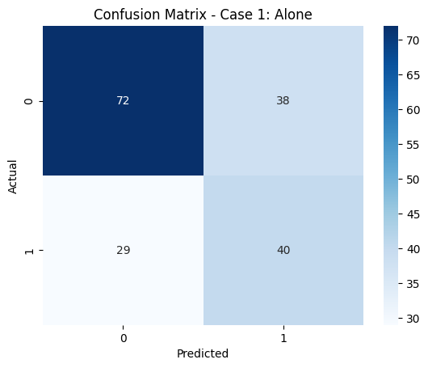
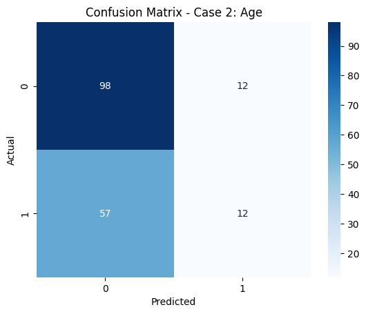
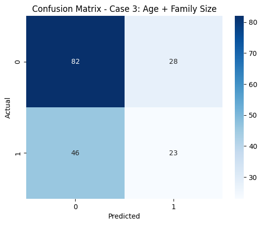
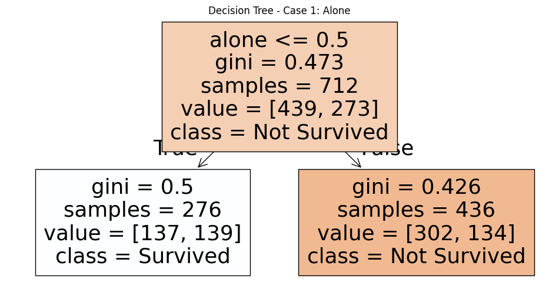
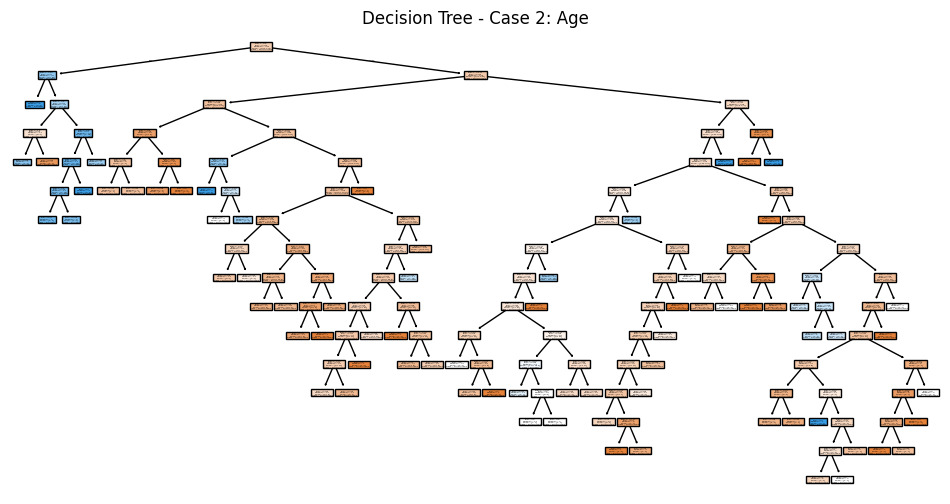
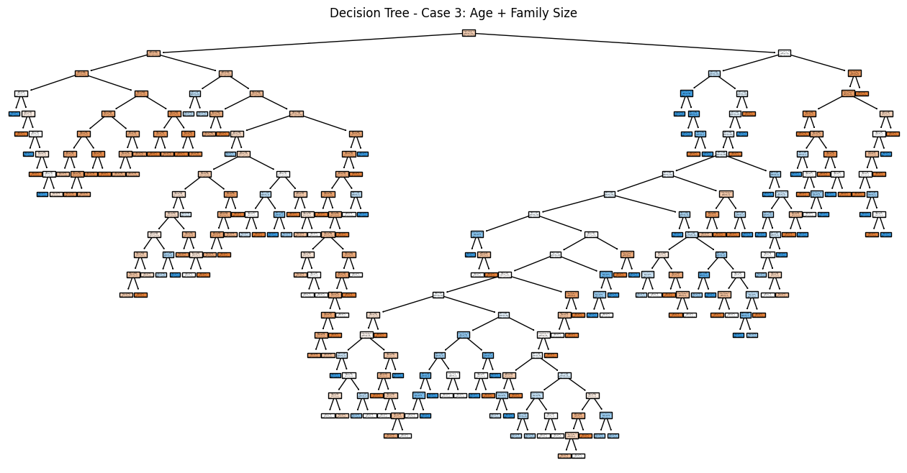
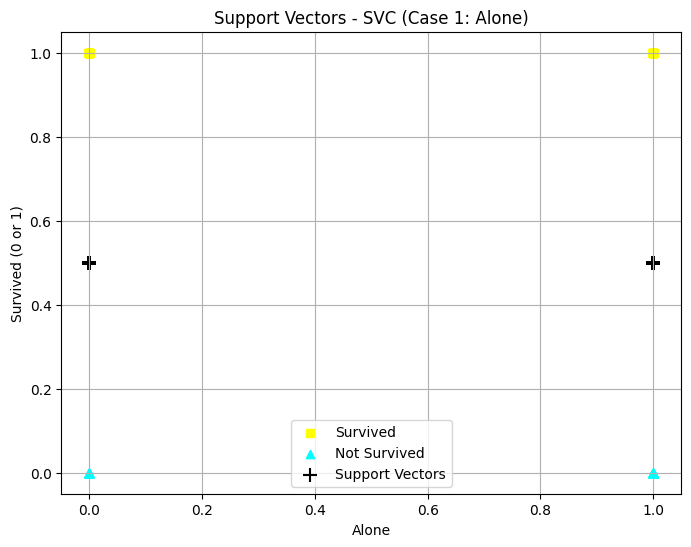
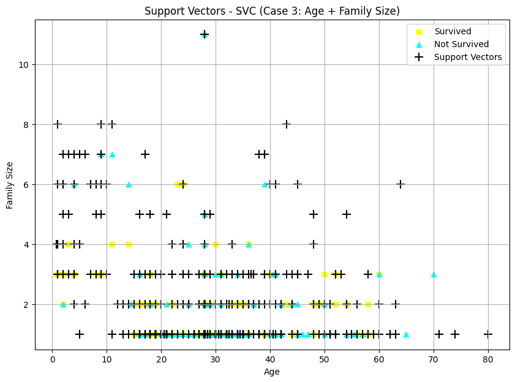
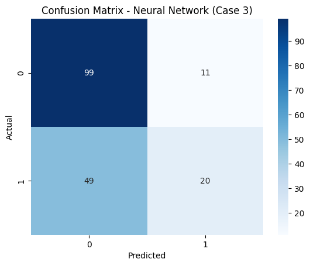
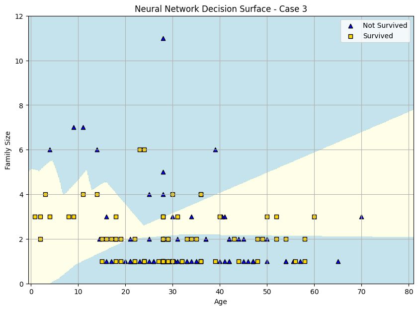

# Beaderstadt Titanic Dataset: Classification Machine Learning Models

**Author:** Alissa Beaderstadt<br>
**Date:** November 3, 2025<br>

## Introduction
In this project, I’ll extend my previous Titanic dataset exploration to include classification models: Decision Tree, Support Vector Machine (SVM), and Neural Network. Then I'll evaluate model performance across three feature sets (Base, Raise the Bar, Lower the Bar).

## Imports
Import the necessary Python libraries for this notebook.  


```python
# Core libraries
import pandas as pd
import seaborn as sns
import matplotlib.pyplot as plt
import numpy as np

# Model selection
from sklearn.model_selection import StratifiedShuffleSplit

# Models
from sklearn.tree import DecisionTreeClassifier, plot_tree
from sklearn.svm import SVC
from sklearn.neural_network import MLPClassifier

# Evaluation
from sklearn.metrics import classification_report, confusion_matrix

```

## Section 1. Import the Data

### 1.1 Load the Titanic Dataset
The Titanic dataset is built into `Seaborn`, so we can easily load it without needing to import an external file. We don't need a detailed inspection of the data as we've done that previously and are familiar.


```python
# Load Titanic dataset
titanic = sns.load_dataset('titanic')

# Display just a few records to verify
print(titanic.head(10))
```

       survived  pclass     sex   age  sibsp  parch     fare embarked   class  \
    0         0       3    male  22.0      1      0   7.2500        S   Third   
    1         1       1  female  38.0      1      0  71.2833        C   First   
    2         1       3  female  26.0      0      0   7.9250        S   Third   
    3         1       1  female  35.0      1      0  53.1000        S   First   
    4         0       3    male  35.0      0      0   8.0500        S   Third   
    5         0       3    male   NaN      0      0   8.4583        Q   Third   
    6         0       1    male  54.0      0      0  51.8625        S   First   
    7         0       3    male   2.0      3      1  21.0750        S   Third   
    8         1       3  female  27.0      0      2  11.1333        S   Third   
    9         1       2  female  14.0      1      0  30.0708        C  Second   
    
         who  adult_male deck  embark_town alive  alone  
    0    man        True  NaN  Southampton    no  False  
    1  woman       False    C    Cherbourg   yes  False  
    2  woman       False  NaN  Southampton   yes   True  
    3  woman       False    C  Southampton   yes  False  
    4    man        True  NaN  Southampton    no   True  
    5    man        True  NaN   Queenstown    no   True  
    6    man        True    E  Southampton    no   True  
    7  child       False  NaN  Southampton    no  False  
    8  woman       False  NaN  Southampton   yes  False  
    9  child       False  NaN    Cherbourg   yes  False  
    

## Section 2. Data Exploration and Preparation
### 2.1 Handle Missing Values and Clean Data


```python
# - Fill missing ages with median
median_age = titanic['age'].median()
titanic['age'] = titanic['age'].fillna(median_age)

# - Fill missing embark_town with mode
mode_embark = titanic['embark_town'].mode()[0]
titanic['embark_town'] = titanic['embark_town'].fillna(mode_embark)
```

### 2.2 Feature Engineering
Create any new features that might be helpful for the model from the existing data. This is providing existing data in a more helpful, concise way for modeling.

In this case, we want to add a calculated feature we'll call family_size.


```python
# Create new feature
titanic['family_size'] = titanic['sibsp'] + titanic['parch'] + 1

# Map categories to numeric values
titanic['sex'] = titanic['sex'].map({'male': 0, 'female': 1})
titanic['embarked'] = titanic['embarked'].map({'C': 0, 'Q': 1, 'S': 2})
titanic['alone'] = titanic['alone'].astype(int)
```

## Section 3. Feature Selection and Justification
### 3.1 Choose features and target
**Target:**
- Survived (0 = did not survive, 1 = survived).<br>
**Feature Cases:**
1. **Case 1: Single feature** - `alone`
    - Why: Being alone might affect survival; family or groups may have influenced who got rescued first.
2. **Case 2: Single feature** - `age`
    - Why: Age is historically important; children often had higher survival rates.
3. **Case 3: Two features** - `age` + `family_size`
    - Why: Combining age with family size may capture survival patterns better; families traveling together might have increased or decreased chances.


### 3.2 Define X (features) and y (target)
- Assign input features to X a pandas DataFrame with 1 or more input features
- Assign target variable to y (as applicable) - a pandas Series with a single target feature
- Again - use comments to run a single case at a time
- The follow starts with only the statements needed for case 1. 
- Double brackets [[ ]]  makes a 2D DataFrame
- Single brackets [ ]  make a 1D Series


```python
# -----------------------------
# Case 1: Feature = alone
# -----------------------------
# Select the feature 'alone' as input (2D DataFrame)
X1 = titanic[['alone']]

# Select 'survived' as the target (1D Series)
y1 = titanic['survived']


# -----------------------------
# Case 2: Feature = age
# -----------------------------
# Select the feature 'age' and drop rows with missing values
X2 = titanic[['age']].dropna()

# Select matching 'survived' values using the same indices
y2 = titanic.loc[X2.index, 'survived']


# -----------------------------
# Case 3: Features = age + family_size
# -----------------------------
# Select both 'age' and 'family_size', drop rows with missing values
X3 = titanic[['age', 'family_size']].dropna()

# Select corresponding 'survived' values
y3 = titanic.loc[X3.index, 'survived']

```

**Reflection 3:** 

1. Why are these features selected?
   - `alone`: An indicator of whether the passenger had family.
   - `age`: Survival may depend on age (children and women may have survived more).
   - `family_size`: Captures whether traveling in a group influences survival.
   - Combining features (age + family_size) may uncover interactions that single features can’t capture.

2. Which features are likely highly predictive?
   - `alone` may be predictive because social/family structures mattered.
   - `age` is often predictive because children and women may have survived more.
   - `family_size` could affect survival if families stayed together or helped each other.


## Section 4. Train a Classification Model (Decision Tree) <br>
Split the data, train decision tree models for three feature cases, evaluate performance, and visualize results.
### 4.1 Split the Data
We’ll use StratifiedShuffleSplit to maintain the same proportion of survivors in training and test sets.


```python
# -----------------------------
# Case 1: Feature = alone
# -----------------------------
splitter1 = StratifiedShuffleSplit(n_splits=1, test_size=0.2, random_state=123)
for train_idx1, test_idx1 in splitter1.split(X1, y1):
    X1_train = X1.iloc[train_idx1]
    X1_test  = X1.iloc[test_idx1]
    y1_train = y1.iloc[train_idx1]
    y1_test  = y1.iloc[test_idx1]

print('Case 1 - Alone:')
print('Train size:', len(X1_train), '| Test size:', len(X1_test))


# -----------------------------
# Case 2: Feature = age
# -----------------------------
splitter2 = StratifiedShuffleSplit(n_splits=1, test_size=0.2, random_state=123)
for train_idx2, test_idx2 in splitter2.split(X2, y2):
    X2_train = X2.iloc[train_idx2]
    X2_test  = X2.iloc[test_idx2]
    y2_train = y2.iloc[train_idx2]
    y2_test  = y2.iloc[test_idx2]

print('Case 2 - Age:')
print('Train size:', len(X2_train), '| Test size:', len(X2_test))


# -----------------------------
# Case 3: Features = age + family_size
# -----------------------------
splitter3 = StratifiedShuffleSplit(n_splits=1, test_size=0.2, random_state=123)
for train_idx3, test_idx3 in splitter3.split(X3, y3):
    X3_train = X3.iloc[train_idx3]
    X3_test  = X3.iloc[test_idx3]
    y3_train = y3.iloc[train_idx3]
    y3_test  = y3.iloc[test_idx3]

print('Case 3 - Age + Family Size:')
print('Train size:', len(X3_train), '| Test size:', len(X3_test))

```

    Case 1 - Alone:
    Train size: 712 | Test size: 179
    Case 2 - Age:
    Train size: 712 | Test size: 179
    Case 3 - Age + Family Size:
    Train size: 712 | Test size: 179
    

### 4.2 Create and Train Model (Decision Tree)
Create and train a decision tree model with no random initializer argument.


```python
# -----------------------------
# CASE 1: Decision Tree using alone
# -----------------------------
tree_model1 = DecisionTreeClassifier()
tree_model1.fit(X1_train, y1_train)

# -----------------------------
# CASE 2: Decision Tree using age
# -----------------------------
tree_model2 = DecisionTreeClassifier()
tree_model2.fit(X2_train, y2_train)

# -----------------------------
# CASE 3: Decision Tree using age and family_size
# -----------------------------
tree_model3 = DecisionTreeClassifier()
tree_model3.fit(X3_train, y3_train)
```


<style>#sk-container-id-9 {
  /* Definition of color scheme common for light and dark mode */
  --sklearn-color-text: #000;
  --sklearn-color-text-muted: #666;
  --sklearn-color-line: gray;
  /* Definition of color scheme for unfitted estimators */
  --sklearn-color-unfitted-level-0: #fff5e6;
  --sklearn-color-unfitted-level-1: #f6e4d2;
  --sklearn-color-unfitted-level-2: #ffe0b3;
  --sklearn-color-unfitted-level-3: chocolate;
  /* Definition of color scheme for fitted estimators */
  --sklearn-color-fitted-level-0: #f0f8ff;
  --sklearn-color-fitted-level-1: #d4ebff;
  --sklearn-color-fitted-level-2: #b3dbfd;
  --sklearn-color-fitted-level-3: cornflowerblue;

  /* Specific color for light theme */
  --sklearn-color-text-on-default-background: var(--sg-text-color, var(--theme-code-foreground, var(--jp-content-font-color1, black)));
  --sklearn-color-background: var(--sg-background-color, var(--theme-background, var(--jp-layout-color0, white)));
  --sklearn-color-border-box: var(--sg-text-color, var(--theme-code-foreground, var(--jp-content-font-color1, black)));
  --sklearn-color-icon: #696969;

  @media (prefers-color-scheme: dark) {
    /* Redefinition of color scheme for dark theme */
    --sklearn-color-text-on-default-background: var(--sg-text-color, var(--theme-code-foreground, var(--jp-content-font-color1, white)));
    --sklearn-color-background: var(--sg-background-color, var(--theme-background, var(--jp-layout-color0, #111)));
    --sklearn-color-border-box: var(--sg-text-color, var(--theme-code-foreground, var(--jp-content-font-color1, white)));
    --sklearn-color-icon: #878787;
  }
}

#sk-container-id-9 {
  color: var(--sklearn-color-text);
}

#sk-container-id-9 pre {
  padding: 0;
}

#sk-container-id-9 input.sk-hidden--visually {
  border: 0;
  clip: rect(1px 1px 1px 1px);
  clip: rect(1px, 1px, 1px, 1px);
  height: 1px;
  margin: -1px;
  overflow: hidden;
  padding: 0;
  position: absolute;
  width: 1px;
}

#sk-container-id-9 div.sk-dashed-wrapped {
  border: 1px dashed var(--sklearn-color-line);
  margin: 0 0.4em 0.5em 0.4em;
  box-sizing: border-box;
  padding-bottom: 0.4em;
  background-color: var(--sklearn-color-background);
}

#sk-container-id-9 div.sk-container {
  /* jupyter's `normalize.less` sets `[hidden] { display: none; }`
     but bootstrap.min.css set `[hidden] { display: none !important; }`
     so we also need the `!important` here to be able to override the
     default hidden behavior on the sphinx rendered scikit-learn.org.
     See: https://github.com/scikit-learn/scikit-learn/issues/21755 */
  display: inline-block !important;
  position: relative;
}

#sk-container-id-9 div.sk-text-repr-fallback {
  display: none;
}

div.sk-parallel-item,
div.sk-serial,
div.sk-item {
  /* draw centered vertical line to link estimators */
  background-image: linear-gradient(var(--sklearn-color-text-on-default-background), var(--sklearn-color-text-on-default-background));
  background-size: 2px 100%;
  background-repeat: no-repeat;
  background-position: center center;
}

/* Parallel-specific style estimator block */

#sk-container-id-9 div.sk-parallel-item::after {
  content: "";
  width: 100%;
  border-bottom: 2px solid var(--sklearn-color-text-on-default-background);
  flex-grow: 1;
}

#sk-container-id-9 div.sk-parallel {
  display: flex;
  align-items: stretch;
  justify-content: center;
  background-color: var(--sklearn-color-background);
  position: relative;
}

#sk-container-id-9 div.sk-parallel-item {
  display: flex;
  flex-direction: column;
}

#sk-container-id-9 div.sk-parallel-item:first-child::after {
  align-self: flex-end;
  width: 50%;
}

#sk-container-id-9 div.sk-parallel-item:last-child::after {
  align-self: flex-start;
  width: 50%;
}

#sk-container-id-9 div.sk-parallel-item:only-child::after {
  width: 0;
}

/* Serial-specific style estimator block */

#sk-container-id-9 div.sk-serial {
  display: flex;
  flex-direction: column;
  align-items: center;
  background-color: var(--sklearn-color-background);
  padding-right: 1em;
  padding-left: 1em;
}


/* Toggleable style: style used for estimator/Pipeline/ColumnTransformer box that is
clickable and can be expanded/collapsed.
- Pipeline and ColumnTransformer use this feature and define the default style
- Estimators will overwrite some part of the style using the `sk-estimator` class
*/

/* Pipeline and ColumnTransformer style (default) */

#sk-container-id-9 div.sk-toggleable {
  /* Default theme specific background. It is overwritten whether we have a
  specific estimator or a Pipeline/ColumnTransformer */
  background-color: var(--sklearn-color-background);
}

/* Toggleable label */
#sk-container-id-9 label.sk-toggleable__label {
  cursor: pointer;
  display: flex;
  width: 100%;
  margin-bottom: 0;
  padding: 0.5em;
  box-sizing: border-box;
  text-align: center;
  align-items: start;
  justify-content: space-between;
  gap: 0.5em;
}

#sk-container-id-9 label.sk-toggleable__label .caption {
  font-size: 0.6rem;
  font-weight: lighter;
  color: var(--sklearn-color-text-muted);
}

#sk-container-id-9 label.sk-toggleable__label-arrow:before {
  /* Arrow on the left of the label */
  content: "▸";
  float: left;
  margin-right: 0.25em;
  color: var(--sklearn-color-icon);
}

#sk-container-id-9 label.sk-toggleable__label-arrow:hover:before {
  color: var(--sklearn-color-text);
}

/* Toggleable content - dropdown */

#sk-container-id-9 div.sk-toggleable__content {
  display: none;
  text-align: left;
  /* unfitted */
  background-color: var(--sklearn-color-unfitted-level-0);
}

#sk-container-id-9 div.sk-toggleable__content.fitted {
  /* fitted */
  background-color: var(--sklearn-color-fitted-level-0);
}

#sk-container-id-9 div.sk-toggleable__content pre {
  margin: 0.2em;
  border-radius: 0.25em;
  color: var(--sklearn-color-text);
  /* unfitted */
  background-color: var(--sklearn-color-unfitted-level-0);
}

#sk-container-id-9 div.sk-toggleable__content.fitted pre {
  /* unfitted */
  background-color: var(--sklearn-color-fitted-level-0);
}

#sk-container-id-9 input.sk-toggleable__control:checked~div.sk-toggleable__content {
  /* Expand drop-down */
  display: block;
  width: 100%;
  overflow: visible;
}

#sk-container-id-9 input.sk-toggleable__control:checked~label.sk-toggleable__label-arrow:before {
  content: "▾";
}

/* Pipeline/ColumnTransformer-specific style */

#sk-container-id-9 div.sk-label input.sk-toggleable__control:checked~label.sk-toggleable__label {
  color: var(--sklearn-color-text);
  background-color: var(--sklearn-color-unfitted-level-2);
}

#sk-container-id-9 div.sk-label.fitted input.sk-toggleable__control:checked~label.sk-toggleable__label {
  background-color: var(--sklearn-color-fitted-level-2);
}

/* Estimator-specific style */

/* Colorize estimator box */
#sk-container-id-9 div.sk-estimator input.sk-toggleable__control:checked~label.sk-toggleable__label {
  /* unfitted */
  background-color: var(--sklearn-color-unfitted-level-2);
}

#sk-container-id-9 div.sk-estimator.fitted input.sk-toggleable__control:checked~label.sk-toggleable__label {
  /* fitted */
  background-color: var(--sklearn-color-fitted-level-2);
}

#sk-container-id-9 div.sk-label label.sk-toggleable__label,
#sk-container-id-9 div.sk-label label {
  /* The background is the default theme color */
  color: var(--sklearn-color-text-on-default-background);
}

/* On hover, darken the color of the background */
#sk-container-id-9 div.sk-label:hover label.sk-toggleable__label {
  color: var(--sklearn-color-text);
  background-color: var(--sklearn-color-unfitted-level-2);
}

/* Label box, darken color on hover, fitted */
#sk-container-id-9 div.sk-label.fitted:hover label.sk-toggleable__label.fitted {
  color: var(--sklearn-color-text);
  background-color: var(--sklearn-color-fitted-level-2);
}

/* Estimator label */

#sk-container-id-9 div.sk-label label {
  font-family: monospace;
  font-weight: bold;
  display: inline-block;
  line-height: 1.2em;
}

#sk-container-id-9 div.sk-label-container {
  text-align: center;
}

/* Estimator-specific */
#sk-container-id-9 div.sk-estimator {
  font-family: monospace;
  border: 1px dotted var(--sklearn-color-border-box);
  border-radius: 0.25em;
  box-sizing: border-box;
  margin-bottom: 0.5em;
  /* unfitted */
  background-color: var(--sklearn-color-unfitted-level-0);
}

#sk-container-id-9 div.sk-estimator.fitted {
  /* fitted */
  background-color: var(--sklearn-color-fitted-level-0);
}

/* on hover */
#sk-container-id-9 div.sk-estimator:hover {
  /* unfitted */
  background-color: var(--sklearn-color-unfitted-level-2);
}

#sk-container-id-9 div.sk-estimator.fitted:hover {
  /* fitted */
  background-color: var(--sklearn-color-fitted-level-2);
}

/* Specification for estimator info (e.g. "i" and "?") */

/* Common style for "i" and "?" */

.sk-estimator-doc-link,
a:link.sk-estimator-doc-link,
a:visited.sk-estimator-doc-link {
  float: right;
  font-size: smaller;
  line-height: 1em;
  font-family: monospace;
  background-color: var(--sklearn-color-background);
  border-radius: 1em;
  height: 1em;
  width: 1em;
  text-decoration: none !important;
  margin-left: 0.5em;
  text-align: center;
  /* unfitted */
  border: var(--sklearn-color-unfitted-level-1) 1pt solid;
  color: var(--sklearn-color-unfitted-level-1);
}

.sk-estimator-doc-link.fitted,
a:link.sk-estimator-doc-link.fitted,
a:visited.sk-estimator-doc-link.fitted {
  /* fitted */
  border: var(--sklearn-color-fitted-level-1) 1pt solid;
  color: var(--sklearn-color-fitted-level-1);
}

/* On hover */
div.sk-estimator:hover .sk-estimator-doc-link:hover,
.sk-estimator-doc-link:hover,
div.sk-label-container:hover .sk-estimator-doc-link:hover,
.sk-estimator-doc-link:hover {
  /* unfitted */
  background-color: var(--sklearn-color-unfitted-level-3);
  color: var(--sklearn-color-background);
  text-decoration: none;
}

div.sk-estimator.fitted:hover .sk-estimator-doc-link.fitted:hover,
.sk-estimator-doc-link.fitted:hover,
div.sk-label-container:hover .sk-estimator-doc-link.fitted:hover,
.sk-estimator-doc-link.fitted:hover {
  /* fitted */
  background-color: var(--sklearn-color-fitted-level-3);
  color: var(--sklearn-color-background);
  text-decoration: none;
}

/* Span, style for the box shown on hovering the info icon */
.sk-estimator-doc-link span {
  display: none;
  z-index: 9999;
  position: relative;
  font-weight: normal;
  right: .2ex;
  padding: .5ex;
  margin: .5ex;
  width: min-content;
  min-width: 20ex;
  max-width: 50ex;
  color: var(--sklearn-color-text);
  box-shadow: 2pt 2pt 4pt #999;
  /* unfitted */
  background: var(--sklearn-color-unfitted-level-0);
  border: .5pt solid var(--sklearn-color-unfitted-level-3);
}

.sk-estimator-doc-link.fitted span {
  /* fitted */
  background: var(--sklearn-color-fitted-level-0);
  border: var(--sklearn-color-fitted-level-3);
}

.sk-estimator-doc-link:hover span {
  display: block;
}

/* "?"-specific style due to the `<a>` HTML tag */

#sk-container-id-9 a.estimator_doc_link {
  float: right;
  font-size: 1rem;
  line-height: 1em;
  font-family: monospace;
  background-color: var(--sklearn-color-background);
  border-radius: 1rem;
  height: 1rem;
  width: 1rem;
  text-decoration: none;
  /* unfitted */
  color: var(--sklearn-color-unfitted-level-1);
  border: var(--sklearn-color-unfitted-level-1) 1pt solid;
}

#sk-container-id-9 a.estimator_doc_link.fitted {
  /* fitted */
  border: var(--sklearn-color-fitted-level-1) 1pt solid;
  color: var(--sklearn-color-fitted-level-1);
}

/* On hover */
#sk-container-id-9 a.estimator_doc_link:hover {
  /* unfitted */
  background-color: var(--sklearn-color-unfitted-level-3);
  color: var(--sklearn-color-background);
  text-decoration: none;
}

#sk-container-id-9 a.estimator_doc_link.fitted:hover {
  /* fitted */
  background-color: var(--sklearn-color-fitted-level-3);
}

.estimator-table summary {
    padding: .5rem;
    font-family: monospace;
    cursor: pointer;
}

.estimator-table details[open] {
    padding-left: 0.1rem;
    padding-right: 0.1rem;
    padding-bottom: 0.3rem;
}

.estimator-table .parameters-table {
    margin-left: auto !important;
    margin-right: auto !important;
}

.estimator-table .parameters-table tr:nth-child(odd) {
    background-color: #fff;
}

.estimator-table .parameters-table tr:nth-child(even) {
    background-color: #f6f6f6;
}

.estimator-table .parameters-table tr:hover {
    background-color: #e0e0e0;
}

.estimator-table table td {
    border: 1px solid rgba(106, 105, 104, 0.232);
}

.user-set td {
    color:rgb(255, 94, 0);
    text-align: left;
}

.user-set td.value pre {
    color:rgb(255, 94, 0) !important;
    background-color: transparent !important;
}

.default td {
    color: black;
    text-align: left;
}

.user-set td i,
.default td i {
    color: black;
}

.copy-paste-icon {
    background-image: url(data:image/svg+xml;base64,PHN2ZyB4bWxucz0iaHR0cDovL3d3dy53My5vcmcvMjAwMC9zdmciIHZpZXdCb3g9IjAgMCA0NDggNTEyIj48IS0tIUZvbnQgQXdlc29tZSBGcmVlIDYuNy4yIGJ5IEBmb250YXdlc29tZSAtIGh0dHBzOi8vZm9udGF3ZXNvbWUuY29tIExpY2Vuc2UgLSBodHRwczovL2ZvbnRhd2Vzb21lLmNvbS9saWNlbnNlL2ZyZWUgQ29weXJpZ2h0IDIwMjUgRm9udGljb25zLCBJbmMuLS0+PHBhdGggZD0iTTIwOCAwTDMzMi4xIDBjMTIuNyAwIDI0LjkgNS4xIDMzLjkgMTQuMWw2Ny45IDY3LjljOSA5IDE0LjEgMjEuMiAxNC4xIDMzLjlMNDQ4IDMzNmMwIDI2LjUtMjEuNSA0OC00OCA0OGwtMTkyIDBjLTI2LjUgMC00OC0yMS41LTQ4LTQ4bDAtMjg4YzAtMjYuNSAyMS41LTQ4IDQ4LTQ4ek00OCAxMjhsODAgMCAwIDY0LTY0IDAgMCAyNTYgMTkyIDAgMC0zMiA2NCAwIDAgNDhjMCAyNi41LTIxLjUgNDgtNDggNDhMNDggNTEyYy0yNi41IDAtNDgtMjEuNS00OC00OEwwIDE3NmMwLTI2LjUgMjEuNS00OCA0OC00OHoiLz48L3N2Zz4=);
    background-repeat: no-repeat;
    background-size: 14px 14px;
    background-position: 0;
    display: inline-block;
    width: 14px;
    height: 14px;
    cursor: pointer;
}
</style><body><div id="sk-container-id-9" class="sk-top-container"><div class="sk-text-repr-fallback"><pre>DecisionTreeClassifier()</pre><b>In a Jupyter environment, please rerun this cell to show the HTML representation or trust the notebook. <br />On GitHub, the HTML representation is unable to render, please try loading this page with nbviewer.org.</b></div><div class="sk-container" hidden><div class="sk-item"><div class="sk-estimator fitted sk-toggleable"><input class="sk-toggleable__control sk-hidden--visually" id="sk-estimator-id-9" type="checkbox" checked><label for="sk-estimator-id-9" class="sk-toggleable__label fitted sk-toggleable__label-arrow"><div><div>DecisionTreeClassifier</div></div><div><a class="sk-estimator-doc-link fitted" rel="noreferrer" target="_blank" href="https://scikit-learn.org/1.7/modules/generated/sklearn.tree.DecisionTreeClassifier.html">?<span>Documentation for DecisionTreeClassifier</span></a><span class="sk-estimator-doc-link fitted">i<span>Fitted</span></span></div></label><div class="sk-toggleable__content fitted" data-param-prefix="">
        <div class="estimator-table">
            <details>
                <summary>Parameters</summary>
                <table class="parameters-table">
                  <tbody>

        <tr class="default">
            <td><i class="copy-paste-icon"
                 onclick="copyToClipboard('criterion',
                          this.parentElement.nextElementSibling)"
            ></i></td>
            <td class="param">criterion&nbsp;</td>
            <td class="value">&#x27;gini&#x27;</td>
        </tr>


        <tr class="default">
            <td><i class="copy-paste-icon"
                 onclick="copyToClipboard('splitter',
                          this.parentElement.nextElementSibling)"
            ></i></td>
            <td class="param">splitter&nbsp;</td>
            <td class="value">&#x27;best&#x27;</td>
        </tr>


        <tr class="default">
            <td><i class="copy-paste-icon"
                 onclick="copyToClipboard('max_depth',
                          this.parentElement.nextElementSibling)"
            ></i></td>
            <td class="param">max_depth&nbsp;</td>
            <td class="value">None</td>
        </tr>


        <tr class="default">
            <td><i class="copy-paste-icon"
                 onclick="copyToClipboard('min_samples_split',
                          this.parentElement.nextElementSibling)"
            ></i></td>
            <td class="param">min_samples_split&nbsp;</td>
            <td class="value">2</td>
        </tr>


        <tr class="default">
            <td><i class="copy-paste-icon"
                 onclick="copyToClipboard('min_samples_leaf',
                          this.parentElement.nextElementSibling)"
            ></i></td>
            <td class="param">min_samples_leaf&nbsp;</td>
            <td class="value">1</td>
        </tr>


        <tr class="default">
            <td><i class="copy-paste-icon"
                 onclick="copyToClipboard('min_weight_fraction_leaf',
                          this.parentElement.nextElementSibling)"
            ></i></td>
            <td class="param">min_weight_fraction_leaf&nbsp;</td>
            <td class="value">0.0</td>
        </tr>


        <tr class="default">
            <td><i class="copy-paste-icon"
                 onclick="copyToClipboard('max_features',
                          this.parentElement.nextElementSibling)"
            ></i></td>
            <td class="param">max_features&nbsp;</td>
            <td class="value">None</td>
        </tr>


        <tr class="default">
            <td><i class="copy-paste-icon"
                 onclick="copyToClipboard('random_state',
                          this.parentElement.nextElementSibling)"
            ></i></td>
            <td class="param">random_state&nbsp;</td>
            <td class="value">None</td>
        </tr>


        <tr class="default">
            <td><i class="copy-paste-icon"
                 onclick="copyToClipboard('max_leaf_nodes',
                          this.parentElement.nextElementSibling)"
            ></i></td>
            <td class="param">max_leaf_nodes&nbsp;</td>
            <td class="value">None</td>
        </tr>


        <tr class="default">
            <td><i class="copy-paste-icon"
                 onclick="copyToClipboard('min_impurity_decrease',
                          this.parentElement.nextElementSibling)"
            ></i></td>
            <td class="param">min_impurity_decrease&nbsp;</td>
            <td class="value">0.0</td>
        </tr>


        <tr class="default">
            <td><i class="copy-paste-icon"
                 onclick="copyToClipboard('class_weight',
                          this.parentElement.nextElementSibling)"
            ></i></td>
            <td class="param">class_weight&nbsp;</td>
            <td class="value">None</td>
        </tr>


        <tr class="default">
            <td><i class="copy-paste-icon"
                 onclick="copyToClipboard('ccp_alpha',
                          this.parentElement.nextElementSibling)"
            ></i></td>
            <td class="param">ccp_alpha&nbsp;</td>
            <td class="value">0.0</td>
        </tr>


        <tr class="default">
            <td><i class="copy-paste-icon"
                 onclick="copyToClipboard('monotonic_cst',
                          this.parentElement.nextElementSibling)"
            ></i></td>
            <td class="param">monotonic_cst&nbsp;</td>
            <td class="value">None</td>
        </tr>

                  </tbody>
                </table>
            </details>
        </div>
    </div></div></div></div></div><script>function copyToClipboard(text, element) {
    // Get the parameter prefix from the closest toggleable content
    const toggleableContent = element.closest('.sk-toggleable__content');
    const paramPrefix = toggleableContent ? toggleableContent.dataset.paramPrefix : '';
    const fullParamName = paramPrefix ? `${paramPrefix}${text}` : text;

    const originalStyle = element.style;
    const computedStyle = window.getComputedStyle(element);
    const originalWidth = computedStyle.width;
    const originalHTML = element.innerHTML.replace('Copied!', '');

    navigator.clipboard.writeText(fullParamName)
        .then(() => {
            element.style.width = originalWidth;
            element.style.color = 'green';
            element.innerHTML = "Copied!";

            setTimeout(() => {
                element.innerHTML = originalHTML;
                element.style = originalStyle;
            }, 2000);
        })
        .catch(err => {
            console.error('Failed to copy:', err);
            element.style.color = 'red';
            element.innerHTML = "Failed!";
            setTimeout(() => {
                element.innerHTML = originalHTML;
                element.style = originalStyle;
            }, 2000);
        });
    return false;
}

document.querySelectorAll('.fa-regular.fa-copy').forEach(function(element) {
    const toggleableContent = element.closest('.sk-toggleable__content');
    const paramPrefix = toggleableContent ? toggleableContent.dataset.paramPrefix : '';
    const paramName = element.parentElement.nextElementSibling.textContent.trim();
    const fullParamName = paramPrefix ? `${paramPrefix}${paramName}` : paramName;

    element.setAttribute('title', fullParamName);
});
</script></body>


### 4.3 Predict and Evaluate Model Performance
Evaluate model performance on training data.


```python
# -----------------------------
# Case 1: Predictions and Evaluation
# -----------------------------
y1_pred = tree_model1.predict(X1_train)
print("Decision Tree Training Results - Case 1 (Alone):")
print(classification_report(y1_train, y1_pred))

y1_test_pred = tree_model1.predict(X1_test)
print("Decision Tree Test Results - Case 1 (Alone):")
print(classification_report(y1_test, y1_test_pred))

```

    Decision Tree Training Results - Case 1 (Alone):
                  precision    recall  f1-score   support
    
               0       0.69      0.69      0.69       439
               1       0.50      0.51      0.51       273
    
        accuracy                           0.62       712
       macro avg       0.60      0.60      0.60       712
    weighted avg       0.62      0.62      0.62       712
    
    Decision Tree Test Results - Case 1 (Alone):
                  precision    recall  f1-score   support
    
               0       0.71      0.65      0.68       110
               1       0.51      0.58      0.54        69
    
        accuracy                           0.63       179
       macro avg       0.61      0.62      0.61       179
    weighted avg       0.64      0.63      0.63       179
    
    


```python
# -----------------------------
# Case 2: Predictions and Evaluation
# -----------------------------
y2_pred = tree_model2.predict(X2_train)
print("Decision Tree Training Results - Case 2 (Age):")
print(classification_report(y2_train, y2_pred))

y2_test_pred = tree_model2.predict(X2_test)
print("Decision Tree Test Results - Case 2 (Age):")
print(classification_report(y2_test, y2_test_pred))
```

    Decision Tree Training Results - Case 2 (Age):
                  precision    recall  f1-score   support
    
               0       0.68      0.92      0.78       439
               1       0.69      0.29      0.41       273
    
        accuracy                           0.68       712
       macro avg       0.68      0.61      0.60       712
    weighted avg       0.68      0.68      0.64       712
    
    Decision Tree Test Results - Case 2 (Age):
                  precision    recall  f1-score   support
    
               0       0.63      0.89      0.74       110
               1       0.50      0.17      0.26        69
    
        accuracy                           0.61       179
       macro avg       0.57      0.53      0.50       179
    weighted avg       0.58      0.61      0.55       179
    
    


```python
# -----------------------------
# Case 3: Predictions and Evaluation
# -----------------------------
y3_pred = tree_model3.predict(X3_train)
print("Decision Tree Training Results - Case 3 (Age + Family Size):")
print(classification_report(y3_train, y3_pred))

y3_test_pred = tree_model3.predict(X3_test)
print("Decision Tree Test Results - Case 3 (Age + Family Size):")
print(classification_report(y3_test, y3_test_pred))
```

    Decision Tree Training Results - Case 3 (Age + Family Size):
                  precision    recall  f1-score   support
    
               0       0.77      0.90      0.83       439
               1       0.77      0.56      0.65       273
    
        accuracy                           0.77       712
       macro avg       0.77      0.73      0.74       712
    weighted avg       0.77      0.77      0.76       712
    
    Decision Tree Test Results - Case 3 (Age + Family Size):
                  precision    recall  f1-score   support
    
               0       0.64      0.75      0.69       110
               1       0.45      0.33      0.38        69
    
        accuracy                           0.59       179
       macro avg       0.55      0.54      0.54       179
    weighted avg       0.57      0.59      0.57       179
    
    

### 4.4 Report Confusion Matrix (as a heatmap)
Plot a confusion matrix as a heatmap for all three cases.


```python
# -----------------------------
# Case 1
# -----------------------------
cm1 = confusion_matrix(y1_test, y1_test_pred)
sns.heatmap(cm1, annot=True, cmap='Blues')
plt.title('Confusion Matrix - Case 1: Alone')
plt.xlabel('Predicted')
plt.ylabel('Actual')
plt.show()


# -----------------------------
# Case 2
# -----------------------------
cm2 = confusion_matrix(y2_test, y2_test_pred)
sns.heatmap(cm2, annot=True, cmap='Blues')
plt.title('Confusion Matrix - Case 2: Age')
plt.xlabel('Predicted')
plt.ylabel('Actual')
plt.show()


# -----------------------------
# Case 3
# -----------------------------
cm3 = confusion_matrix(y3_test, y3_test_pred)
sns.heatmap(cm3, annot=True, cmap='Blues')
plt.title('Confusion Matrix - Case 3: Age + Family Size')
plt.xlabel('Predicted')
plt.ylabel('Actual')
plt.show()

```


    

    


    

    


    

    


### 4.5 Report Decision Tree Plot
Plot the decision tree model for each case. We give the plotter the names of the features and the names of the categories for the target. 


```python
# -----------------------------
# Case 1: Alone
# -----------------------------
fig = plt.figure(figsize=(12, 6))
plot_tree(tree_model1,
          feature_names=X1.columns,
          class_names=['Not Survived', 'Survived'],
          filled=True)
plt.title("Decision Tree - Case 1: Alone")
plt.show()
fig.savefig("tree_case1_alone.png")


# -----------------------------
# Case 2: Age
# -----------------------------
fig = plt.figure(figsize=(12, 6))
plot_tree(tree_model2,
          feature_names=X2.columns,
          class_names=['Not Survived', 'Survived'],
          filled=True)
plt.title("Decision Tree - Case 2: Age")
plt.show()
fig.savefig("tree_case2_age.png")


# -----------------------------
# Case 3: Age + Family Size
# -----------------------------
fig = plt.figure(figsize=(16, 8))
plot_tree(tree_model3,
          feature_names=X3.columns,
          class_names=['Not Survived', 'Survived'],
          filled=True)
plt.title("Decision Tree - Case 3: Age + Family Size")
plt.show()
fig.savefig("tree_case3_age_family.png")

```


    

    


    

    


    

    


**Reflection 4:** 

1. How well did the different cases perform?
   - Case 1 (Alone) got around 63% test accuracy and picked up some survivors, but it was pretty limited. Case 2 (Age) had about the same accuracy, but the model really struggled to catch survivors, so age alone isn’t that strong of a predictor.
2. Are there any surprising results?
    - Adding family_size in Case 3 boosted training accuracy a lot, but it didn’t really help test accuracy. The model still had trouble predicting survivors, which reminds me how tricky imbalanced classes can be.
3. Which inputs worked better? 
    - The ‘alone’ feature (Case 1) stayed consistent between training and test results.
    - Using age + family_size (Case 3) didn’t really help the Decision Tree on the test set. Recall for survivors was even lower than Case 1, so sometimes adding features can actually overfit the model or make it less generalizable.


## Section 5. Compare Alternative Models (SVC, NN) <br>
Train and evaluate Support Vector Machine (SVC) and Neural Network (MLP) models on the Titanic dataset, visualize support vectors, and explore decision boundaries.

SVC Kernel: Common Types

- RBF (Radial Basis Function) – Most commonly used; handles non-linear data well (default)
- Linear – Best for linearly separable data (straight line separation)
- Polynomial – Useful when the data follows a curved pattern
- Sigmoid – Similar to a neural network activation function; less common

### 5.1 Train and Evaluate Model (SVC)


```python
# -----------------------------
# Case 1: SVC using 'alone'
# -----------------------------
svc_model1 = SVC()  # default RBF kernel
svc_model1.fit(X1_train, y1_train)

y1_svc_pred = svc_model1.predict(X1_test)
print("Results for SVC on test data (Case 1 - alone):")
print(classification_report(y1_test, y1_svc_pred))


# -----------------------------
# Case 2: SVC using 'age'
# -----------------------------
svc_model2 = SVC()
svc_model2.fit(X2_train, y2_train)

y2_svc_pred = svc_model2.predict(X2_test)
print("Results for SVC on test data (Case 2 - age):")
print(classification_report(y2_test, y2_svc_pred))


# -----------------------------
# Case 3: SVC using 'age + family_size'
# -----------------------------
svc_model3 = SVC()
svc_model3.fit(X3_train, y3_train)

y3_svc_pred = svc_model3.predict(X3_test)
print("Results for SVC on test data (Case 3 - age + family_size):")
print(classification_report(y3_test, y3_svc_pred))

```

    Results for SVC on test data (Case 1 - alone):
                  precision    recall  f1-score   support
    
               0       0.71      0.65      0.68       110
               1       0.51      0.58      0.54        69
    
        accuracy                           0.63       179
       macro avg       0.61      0.62      0.61       179
    weighted avg       0.64      0.63      0.63       179
    
    Results for SVC on test data (Case 2 - age):
                  precision    recall  f1-score   support
    
               0       0.63      0.98      0.77       110
               1       0.71      0.07      0.13        69
    
        accuracy                           0.63       179
       macro avg       0.67      0.53      0.45       179
    weighted avg       0.66      0.63      0.52       179
    
    Results for SVC on test data (Case 3 - age + family_size):
                  precision    recall  f1-score   support
    
               0       0.63      0.98      0.77       110
               1       0.71      0.07      0.13        69
    
        accuracy                           0.63       179
       macro avg       0.67      0.53      0.45       179
    weighted avg       0.66      0.63      0.52       179
    
    

### 5.2 Visualize Support Vectors (1D Case 1 and 2D Case 3)


```python
# -----------------------------
# Case 1: Feature = 'alone'
# -----------------------------
# Split test data into survived and not survived
survived_alone = X1_test.loc[y1_test == 1, 'alone']
not_survived_alone = X1_test.loc[y1_test == 0, 'alone']

plt.figure(figsize=(8, 6))
plt.scatter(survived_alone, y1_test.loc[y1_test == 1], c='yellow', marker='s', label='Survived')
plt.scatter(not_survived_alone, y1_test.loc[y1_test == 0], c='cyan', marker='^', label='Not Survived')

# Overlay support vectors
if hasattr(svc_model1, 'support_vectors_'):
    support_x = svc_model1.support_vectors_[:, 0]
    plt.scatter(support_x, [0.5]*len(support_x), c='black', marker='+', s=100, label='Support Vectors')

plt.xlabel('Alone')
plt.ylabel('Survived (0 or 1)')
plt.title('Support Vectors - SVC (Case 1: Alone)')
plt.legend()
plt.grid(True)
plt.show()

```


    

    


```python
# -----------------------------
# Case 3: Two Inputs (age + family_size)
# -----------------------------
survived = X3_test[y3_test == 1]
not_survived = X3_test[y3_test == 0]

plt.figure(figsize=(10, 7))
plt.scatter(survived['age'], survived['family_size'], c='yellow', marker='s', label='Survived')
plt.scatter(not_survived['age'], not_survived['family_size'], c='cyan', marker='^', label='Not Survived')

# Overlay support vectors
if hasattr(svc_model3, 'support_vectors_'):
    support_vectors = svc_model3.support_vectors_
    plt.scatter(support_vectors[:, 0], support_vectors[:, 1], c='black', marker='+', s=100, label='Support Vectors')

plt.xlabel('Age')
plt.ylabel('Family Size')
plt.title('Support Vectors - SVC (Case 3: Age + Family Size)')
plt.legend()
plt.grid(True)
plt.show()

```


    

    


### 5.3 Train and Evaluate Model (Neural Network on Case 3)


```python
# - Create and train the neural network for Case 3
nn_model3 = MLPClassifier(
    hidden_layer_sizes=(50, 25, 10),
    solver='lbfgs',
    max_iter=1000,
    random_state=42
)
nn_model3.fit(X3_train, y3_train)

# - Predict on the test set for Case 3
y3_nn_pred = nn_model3.predict(X3_test)

# - Print classification results
print("Results for Neural Network on test data (Case 3 - age + family_size):")
print(classification_report(y3_test, y3_nn_pred))

# - Generate confusion matrix and display as heatmap
cm_nn3 = confusion_matrix(y3_test, y3_nn_pred)
sns.heatmap(cm_nn3, annot=True, fmt='d', cmap='Blues')
plt.title('Confusion Matrix - Neural Network (Case 3)')
plt.xlabel('Predicted')
plt.ylabel('Actual')
plt.show()
```

    Results for Neural Network on test data (Case 3 - age + family_size):
                  precision    recall  f1-score   support
    
               0       0.67      0.90      0.77       110
               1       0.65      0.29      0.40        69
    
        accuracy                           0.66       179
       macro avg       0.66      0.59      0.58       179
    weighted avg       0.66      0.66      0.63       179
    
    


    

    


### 5.4 Visualize (Neural Network on Case 3)


```python
# Get the range of our two features - using padding to enhance appearance
padding = 1
x_min, x_max = X3['age'].min() - padding, X3['age'].max() + padding
y_min, y_max = X3['family_size'].min() - padding, X3['family_size'].max() + padding

# Create meshgrid
xx, yy = np.meshgrid(np.linspace(x_min, x_max, 500),
                     np.linspace(y_min, y_max, 500))

# Predict on all points in the grid
Z = nn_model3.predict(np.c_[xx.ravel(), yy.ravel()])
Z = Z.reshape(xx.shape)

# Plot decision surface
plt.figure(figsize=(10, 7))
cmap_background = ListedColormap(['lightblue', 'lightyellow'])
plt.contourf(xx, yy, Z, cmap=cmap_background, alpha=0.7)

# Overlay actual test data points
plt.scatter(X3_test['age'][y3_test == 0],
            X3_test['family_size'][y3_test == 0],
            c='blue', marker='^', edgecolor='k', label='Not Survived')
plt.scatter(X3_test['age'][y3_test == 1],
            X3_test['family_size'][y3_test == 1],
            c='gold', marker='s', edgecolor='k', label='Survived')

plt.xlabel('Age')
plt.ylabel('Family Size')
plt.title('Neural Network Decision Surface - Case 3')
plt.legend()
plt.grid(True)
plt.show()

```

    c:\Repos\applied-ml-beaderstadt\.venv\Lib\site-packages\sklearn\utils\validation.py:2749: UserWarning: X does not have valid feature names, but MLPClassifier was fitted with feature names
      warnings.warn(
    


    

    


**Reflection 5:** 

1. How well did each of these new models/cases perform?
   - The SVM models were about as accurate as the Decision Trees but had a really hard time catching survivors, especially in Case 2 and Case 3. The Neural Network on Case 3 did a bit better overall and could pick up some more complex patterns with the two features. Still, recall for survivors wasn’t perfect, there’s still room to improve with scaling or more features.
2. Are there any surprising results or insights?
    - Adding family_size helped the Neural Network balance recall between survivors and non-survivors, while SVM and Decision Trees didn’t get much from it. It’s cool to see that models that can handle non-linear relationships squeeze out more predictive power even with just a couple features.
3. Why might one model outperform the others?
    - The Neural Network probably did better because it can learn non-linear interactions between age and family_size. SVM can do non-linear boundaries too but struggled with class imbalance, and Decision Trees overfitted. The NN setup let it generalize a bit better while keeping recall more balanced across survivors and non-survivors.


## Section 6. Final Thoughts & Insights

### Model Comparison Summary

| Model Type | Case | Features Used | Accuracy | Precision | Recall | F1-Score | Notes |
|------------|------|---------------|----------|-----------|--------|-----------|-------|
| Decision Tree | Case 1 | alone | 63% | 51% | 58% | 54% | Tie / Decision Tree & SVM |
|                   | Case 2 | age | 61% | 50% | 17% | 26% | - |
|                   | Case 3 | age + family_size | 59% | 45% | 33% | 38% | - |
|-------------------|------|---------------|----------|-----------|--------|-----------|-------|
| SVM (RBF Kernel)| Case 1 | alone | 63% | 51% | 58% | 54% | Tie / Decision Tree & SVM |
|                    | Case 2 | age | 63% | 71% | 7% | 13% | Best model for Case 2 |
|                    | Case 3 | age + family_size | 63% | 71% | 7% | 13% | - |
|-------------------|------|---------------|----------|-----------|--------|-----------|-------|
| Neural Network (MLP) | Case 3 | age + family_size | 66% | 65% | 29% | 40% | Best model for Case 3 |


### **Challenges and Next Steps**

**What I Learned / Challenges:**  
- Adding features like age + family_size can boost training accuracy, but it doesn’t always help the test set, sometimes the model just overfits. 
- The SVM results for Case 3 looked a lot like Case 2, probably because features weren’t scaled. Family size had a smaller range, so it didn’t make much difference.  
- The Neural Network helped a bit with balancing recall for survivors, but it’s still not perfect. Feature scaling or adding more inputs might help.

**Next Steps / Ideas to Try:**  
- Experiment with other features like `pclass`, `sex`, or `embarked` to see if models improve.  
- Scale or normalize numerical features, especially for SVM and Neural Network models.    


